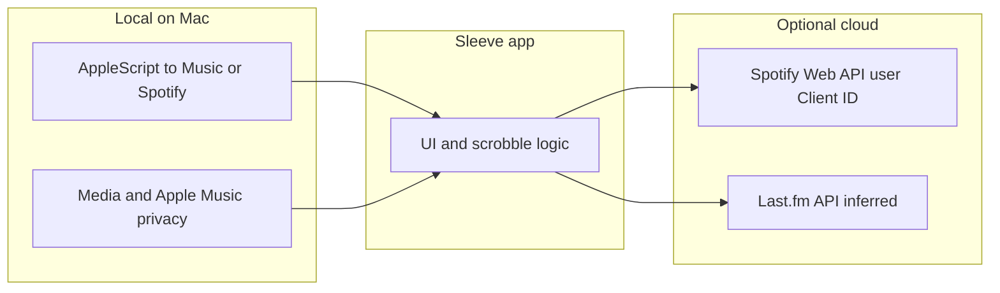

# Presence App — Pre-Build Research Report
**Prepared by:** Craft Agent
**Date:** April 2, 2026
**Based on:** Research Brief by Harshit Beniwal

---

## Summary of Verdicts

| Area | Recommendation |
|---|---|
| Music Platform | **Start with Apple Music only.** Add Spotify later. |
| App Framework | **Swift + AppKit shell / SwiftUI popover hybrid** |
| Backend | **Supabase** — free tier covers launch, zero ops, native Swift SDK |

---

## 1. Music Platform Verdict

### Apple Music

**Reading the currently playing track on macOS** is technically possible but requires care:

- The clean API (`ApplicationMusicPlayer` in MusicKit) is **not available on macOS** — Apple has never shipped it there.
- `MPMusicPlayerController` from the older MediaPlayer framework also **does not work on macOS** — it always returns nil.
- The most reliable public approach is `MPNowPlayingInfoCenter.default().nowPlayingInfo` — this reads the system-wide "now playing" state, which the Music app publishes. It works for any app currently playing audio on the Mac.
- **AppleScript** (`tell application "Music" to get current track`) works for library-based tracks but is **broken for streaming tracks** on macOS 26 Tahoe (a known Apple bug). Use it as a secondary fallback only. The Mac accessory **Sleeve** documents **Media & Apple Music** privacy (in addition to Automation) specifically to fetch information when Apple Music tracks are **streaming** — see [Reference: Sleeve (Replay Software)](#reference-sleeve-replay-software) below.
- A private framework, **`MediaRemote`**, is anecdotally associated with some menu bar music utilities; Apple has tightened related checks in newer macOS releases, so depending on private APIs is fragile and not App Store–safe. **Replay Software’s public Sleeve documentation does not mention MediaRemote**; it describes **AppleScript** to the Music app — do not attribute a specific implementation to Sleeve (or any app) without a primary source.

**Triggering playback** on the user's device:
- Use Apple Music deep-link URLs (`music://` scheme) via `NSWorkspace.shared.open(url)` to hand off to the Music app. This works reliably.
- Requires an **active Apple Music subscription** for full-length tracks.
- No in-process playback API exists for macOS — you're always delegating to the Music app.

**Auth & entitlements:**
- Add the MusicKit capability in Xcode (one checkbox).
- Add `NSAppleMusicUsageDescription` to Info.plist.
- Call `MusicAuthorization.request()` at runtime — triggers the system permission prompt.

**Legal/licensing:**
- Each user must play music through **their own subscription** — you cannot relay or stream music from one user to another.
- Displaying "what a friend is listening to" as metadata (title, artist, artwork) is permitted.
- The "Tune In" feature must work by telling the listener's own Music app to play a matching track — not by routing audio.

---

### Spotify

**Reading the currently playing track:**
- `GET /v1/me/player/currently-playing` — works, returns track name, artist, album art, and playback position.
- **No push/webhook** — you must poll. Practical safe rate: every 1–3 seconds. Exceeding this risks HTTP 429 (rate limit).
- No native macOS SDK — you write `URLSession` calls yourself (or use a community Swift library like `SpotifyAPI`).

**Triggering playback:**
- `PUT /me/player/play` exists and works — but **requires Spotify Premium for the user**. Hard API enforcement, no workaround.

**February 2026 API changes (critical):**
- Developer Mode apps are now limited to **5 authorized users maximum** (was 25).
- **The app owner must have Spotify Premium** or their Dev Mode app stops working entirely.
- Many endpoints were removed (browse, other users' profiles, batch fetches) — but **playback endpoints were not affected**.
- Extended Access (for more than 5 users) now requires a legally registered business with 250,000+ monthly active users. **Individual developers cannot qualify.**

**OAuth for macOS:**
- Use Authorization Code + PKCE flow. Spin up a temporary local server to receive the redirect at `http://127.0.0.1:PORT`. No client secret needed.

**Terms of Service — Hard Restrictions:**
- **Synchronized simultaneous playback to multiple users from one source is prohibited.**
- Accessing other users' profiles via API is no longer possible (endpoints removed Feb 2026).
- Building a feature that mimics Spotify's Group Sessions requires prior written permission from Spotify.
- Displaying your own now-playing state to others (as metadata) is permitted.

---

### Cross-Platform "Tune In" Question

If User A is on Apple Music and User B is on Spotify, syncing is very hard:
- You'd need to search for the same track on the listener's platform by title + artist (fuzzy match), which has reliability issues with live tracks, remixes, and regional availability.
- Both platforms' ToS make multi-user audio relay illegal regardless.

**Recommendation: platform-lock Tune In at launch.** You can only tune in to a friend if you're on the same platform. Display a message if platforms differ.

---

### Platform Recommendation

**Launch with Apple Music only.** Here's why:

| Factor | Apple Music | Spotify |
|---|---|---|
| Reading now-playing on macOS | Possible via system now-playing API | Polling only, no SDK |
| Triggering playback | URL scheme, reliable | Requires Premium, REST only |
| User cap for dev | None (it's your own entitlement) | **5 users max in Dev Mode** |
| ToS risk | Low (metadata display is fine) | Higher (sync language is stricter) |
| macOS-native feel | Natural (delegates to Music.app) | Awkward (no native SDK) |
| Subscription required | Apple Music sub (common among Mac users) | Spotify Premium |

Spotify's **5-user developer cap** alone makes it non-viable for even a small beta. You'd hit that ceiling immediately. Once the app grows and you form a business entity, you can apply for Extended Access and add Spotify in V2.

### Reference: Sleeve (Replay Software)

[Sleeve](https://replay.software/sleeve) is a commercial Mac desktop accessory that displays and controls **Apple Music**, **Spotify**, and **Doppler**. Its public docs are a useful **reference implementation** for how a native utility can source track data without being the player. Sources: [Sleeve overview](https://replay.software/help/sleeve), [Developers](https://replay.software/help/sleeve/developers), [Troubleshooting](https://replay.software/help/sleeve/troubleshooting), [Connect to Spotify](https://replay.software/help/sleeve/spotify), [product page](https://replay.software/sleeve).

**How Sleeve says it reads playback (official):** Replay states that **“Sleeve accesses music apps via AppleScript events.”** For each supported app, Sleeve expects scripting support such as:

| Data | AppleScript pattern (from Replay’s developer doc) |
|---|---|
| Track ID | `tell application YourApp to get id of current track` |
| Title / artist / album | `name` / `artist` / `album` of `current track` |
| Artwork | Spotify: `artwork url of current track` (URL). Apple Music: `data of first artwork of current track` (image data) |
| Playing? | `player state as string` |
| Controls | `tell application YourApp to play` / `pause` / `next track` / `previous track` |
| Love (optional) | get/set `loved of current track` |

**Constraints from Replay:** Sleeve only supports **native macOS apps** (not web players), expects them run from `/Applications`, and lists **Tidal, YouTube Music, Amazon Music, Sonos Player** as unsupported because those apps **do not expose AppleScript** to fetch metadata or control playback.

**macOS permissions (official):**

1. **Automation** — so Sleeve can AppleScript **Music**, **Spotify**, or **Doppler** (Replay documents `tccutil reset AppleEvents com.replay.sleeve` to reset this).
2. **Media & Apple Music** — Replay says this is **new in Sleeve 3** and is **“required to fetch information when tracks are streaming in Apple Music only.”**

**Spotify: two paths (official):**

- **Local app:** The FAQ states Sleeve interacts with the **Spotify app on the Mac** without accessing the user’s Spotify **account** for that path.
- **Spotify Web API (optional):** For **liked songs** and **repeat-one**, Replay has users create a Spotify Developer app, set redirect URI `https://replay.software/spotify/callback`, enable **Web API**, and paste **their Client ID** into Sleeve — see [Connect to Spotify](https://replay.software/help/sleeve/spotify).

**Last.fm (inference):** The product page says users can **connect Last.fm and scrobble**. Replay does **not** publish a technical Last.fm integration page. **Inference (not confirmed by Replay):** Sleeve likely submits scrobbles via **Last.fm’s standard API** using track metadata and timing it already holds from the paths above. Label as inference until verified (e.g. against [Last.fm API](https://www.last.fm/api) docs or traffic inspection).



### Matching Sleeve: metadata + progress

Replay’s developer page is the **minimum** contract Sleeve documents; it does **not** list playback position or duration. Utilities like Sleeve still show a **progress bar** because **Music.app** and **Spotify.app** expose extra properties in their **scripting dictionaries**. Presence can mirror the same patterns if you need Sleeve-like behavior.

**Track name, ID, artwork (same idea as Sleeve)**

| Source | Approach | Permissions / notes |
|---|---|---|
| **AppleScript → `Music` or `Spotify`** | Same properties Replay documents (`id`, `name`, `artist`, `album`, artwork, `player state`) | **Automation** for the target app. For **Apple Music streaming**, consider **Media & Apple Music** as Sleeve does. |
| **`MPNowPlayingInfoCenter`** (recommended first for Apple Music–only) | Read `nowPlayingInfo` for title, artist, album, artwork, identifiers when the active player publishes them | No Automation; whichever app owns **Now Playing** wins. |

**Practical takeaway:** An **Apple Music–first** launch can stay on **`MPNowPlayingInfoCenter` + `music://`**. For **Sleeve-like** direct coupling to Music/Spotify or identical metadata to those apps, add **AppleScript + Automation** (and Media & Apple Music for streaming Apple Music).

**Timeline: current time, duration, scrubber**

Nothing pushes updates; **poll** on a short interval (e.g. **0.5–1 s** while the UI is visible) and optionally interpolate between samples when playing.

| Player | Typical AppleScript | Units / gotchas |
|---|---|---|
| **Spotify.app** | `player position`; `duration of current track` | Widespread reports: position in **seconds**; duration often in **milliseconds** — normalize to seconds. Position can lag in edge cases (e.g. autoplay). |
| **Music.app** | `player position`; `duration of current track` | Usually **seconds** for both; **streaming** can still yield errors or stale duration — use Media & Apple Music where needed and fall back (e.g. hide scrubber). |
| **System Now Playing** | `MPNowPlayingInfoPropertyElapsedPlaybackTime`, `MPMediaItemPropertyPlaybackDuration` in `nowPlayingInfo` | Accuracy depends on how often the publisher updates; refresh periodically. |
| **Spotify Web API** (V2) | `GET /v1/me/player` | `progress_ms`, `item.duration_ms` — polling-based timeline without scripting Spotify.app. |

**Scrobbling relevance (inference):** Track length, position, and play boundaries are what Last.fm-style scrobblers need; Sleeve likely reuses the same timing data it uses for the UI for Last.fm submission.

---

## 2. Framework Verdict

### Recommendation: AppKit shell + SwiftUI content hybrid

This is the production pattern used by the most polished Mac menu bar apps today (Multi.app, Fantastical, Spark, Quill Chat).

**What AppKit owns (~200–400 lines, written once):**
- `NSStatusItem` — the actual icon in the menu bar, including variable width, left/right click handling
- `NSPanel` — the floating window that appears when you click the icon. Use `styleMask: [.borderless, .nonactivatingPanel]` for the clean, "floating card" feel
- Outside-click dismissal via `NSEvent` monitor
- App activation policy (so your app doesn't appear in the Dock)

**What SwiftUI owns (everything the user sees):**
- The entire popover/card UI — friend list, music cards, status indicators
- All animations and transitions
- State management via `@Observable`

**Why not pure SwiftUI's `MenuBarExtra`?**
Apple's built-in `MenuBarExtra` API has unfixed bugs as of macOS 26: double-click required to interact, no callback when the menu opens (so you can't refresh live data), Settings window broken. It's fine for simple utilities. It's a liability for a premium-feel app.

**Why not Electron/Tauri/Flutter?**
- Electron: 200–300 MB idle RAM, 1–2s launch. Hard no.
- Tauri: ~30–90 MB, but still renders inside a WebView — animations cannot match native Core Animation in quality.
- Flutter: Uses its own rendering engine, bypasses AppKit — doesn't look or feel like a Mac app.

### Animation Stack

For the fluid, physics-based feel comparable to Linear or Craft:

| Tool | Use Case |
|---|---|
| SwiftUI `Spring` + `KeyframeAnimator` | Most transitions, state changes — start here |
| `b3ll/Motion` (Swift library) | Gesture-driven, interruptible animations (drag, swipe) |
| Rive | Animated icon in the menu bar itself (responding to status changes) |
| Core Animation directly | Frame-perfect, performance-critical animations if SwiftUI falls short |

### Target Deployment
- **Minimum macOS 14 (Sonoma)** — gets you `@Observable`, `KeyframeAnimator`, `PhaseAnimator`, and the most stable SwiftUI-on-Mac story.

---

## 3. Backend Verdict

### Recommendation: Supabase

**Why Supabase wins for this app:**

1. **Presence is a built-in feature.** `channel.track({ status, current_track })` — one call handles both online/offline detection and music state broadcasting. When a user disconnects (app quits, network drops, Mac sleeps), Supabase automatically fires a `leave` event to all followers within ~5 seconds. No heartbeat logic needed.

2. **Official, stable Swift SDK.** `supabase/supabase-swift` — maintained by Supabase's core team, covers Auth + Realtime + Database. Sign in with Apple has a documented native Swift flow.

3. **One database for everything.** Unlike Firebase (which requires both Realtime Database and Firestore for this use case), Supabase uses Postgres for durable data and its Presence/Broadcast channels for ephemeral state.

4. **Free tier covers your entire launch.** 200 concurrent Realtime connections, 2M messages/month, 50K MAUs — you won't approach any limit at <100 users.

5. **Zero server management.** Fully hosted, no config, no ops. Upgrade by clicking "Pro" in the dashboard.

---

### Rough Data Model

**Postgres tables (permanent data):**

```
profiles         — user accounts (id, username, avatar_url)
follows          — friend graph (follower_id → followee_id)
listen_history   — optional: track played, listened_at (write on track completion only)
```

**Supabase Presence (ephemeral, auto-cleared on disconnect):**

```
Channel: presence:{user_id}

Payload User B tracks:
{
  "status": "listening",
  "current_track": {
    "title": "Song Title",
    "artist": "Artist Name",
    "artwork_url": "https://...",
    "started_at": 1712000000000   ← epoch ms; listener computes elapsed time locally
  }
}
```

**How "Tune In" works:**
1. User A subscribes to `presence:{user_B_id}`.
2. They receive User B's current track payload immediately on subscribe.
3. They call the Apple Music URL scheme to start playing that track on their own device.
4. Every time User B updates their presence (new track), User A receives a `sync` event and their app triggers the next track via URL scheme.
5. If User B disconnects, User A receives a `leave` event → show "offline" state, stop following.

**Music state: ephemeral vs. persisted**
Keep live now-playing state **ephemeral** (Presence only). Write to `listen_history` only on track completion, not on every update. This avoids burning through write quotas and keeps the DB clean.

---

### Cost Estimate

| Phase | Plan | Monthly Cost |
|---|---|---|
| Development / private beta | Free | $0 |
| Production launch (<100 users) | Pro (no project pause, always-on) | $25/month |
| Growth (100–500 users) | Pro (within included quota) | $25/month |

Firebase (Blaze plan) could technically run at $1–5/month at this scale, but it requires two separate databases (RTDB + Firestore), has per-read/write billing that can surprise you, and the macOS SDK carries a "beta" label. Supabase's flat $25/month is more predictable for a founder who isn't monitoring billing dashboards.

---

## 4. Open Questions & Risks

| Risk | Severity | Notes |
|---|---|---|
| `MPNowPlayingInfoCenter` reliability | Medium | Works for Music.app, but other audio apps can "steal" the now-playing slot. Test with Spotify, podcasts, system audio. |
| AppleScript breakage on macOS 26 | Medium | Streaming tracks fail. Use only as fallback for library tracks; don't depend on it. |
| Apple Music deep-link latency | Low–Medium | `music://` URL triggers Music.app to play, but there's a ~0.5–1s handoff delay. For "tune in" with a few seconds of acceptable lag, this is fine. |
| Supabase free tier project pause | Low | Free projects pause after 7 days of inactivity. Annoying during development. Upgrade to Pro ($25) before any real user testing. |
| Spotify if added later | Medium | The 5-user Dev Mode cap means you can't beta-test with real users until you form a business entity and apply for Extended Access. Plan for this in V2 timeline. |
| Cross-platform tune-in | Medium | Even within Apple Music, "Tune In" relies on Apple Music catalog track IDs. If a friend plays a locally imported file (not on Apple Music), there's no equivalent track to play. Decide how to handle this edge case. |
| MusicKit licensing for social sync | Low | Displaying metadata (title, artist, art) is fine. Each user plays via their own subscription. As long as you're not relaying audio, Apple's guidelines are satisfied. |

---

## 5. Suggested Next Steps

Build in this order — each step validates the core technical risk before you invest more:

**Step 1 — Prototype: Reading now-playing state**
Build a minimal macOS app that reads `MPNowPlayingInfoCenter.default().nowPlayingInfo` and displays the track title and artwork. This validates the most important unknown: can you reliably read Apple Music's now-playing state on macOS? Test with streaming tracks, library tracks, and edge cases (nothing playing, paused, etc.).

**Step 2 — Prototype: "Tune In" trigger**
Write a function that takes a track title + artist, looks it up via the Apple Music API, and opens the `music://` URL scheme to trigger playback. Measure the handoff latency. This validates the core interaction.

**Step 3 — Set up Supabase**
Create a free Supabase project. Build the Presence channel plumbing in Swift: one device tracks now-playing state, another device subscribes and displays it. Test the disconnect scenario (close the app on device 1, confirm device 2 shows "offline" within 5 seconds).

**Step 4 — Build the menu bar shell**
Wire together the AppKit `NSStatusItem` + `NSPanel` + SwiftUI popover structure. No real data yet — just the UI skeleton with placeholder friend cards. This validates the framework approach and lets you start designing the real UI.

**Step 5 — Integrate all three**
Connect Step 1 (now-playing reader) → Supabase Presence → another device's music trigger. This is the full end-to-end "Tune In" flow. Once this works, you have a working V0 prototype and the PRD can be written against something real.
